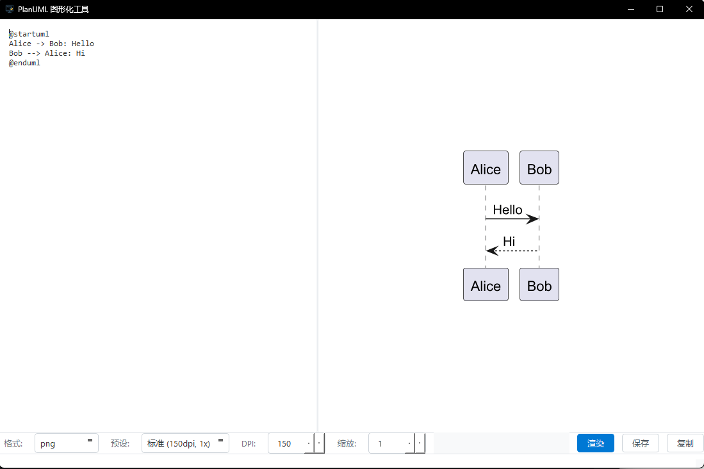

# PlantUmlUtil


一个基于 Python 与 PyQt6 的 PlantUML 图形化工具，提供 PNG/SVG 的实时预览、质量控制（DPI/缩放）、复制与保存输出等功能。内置 `jar/plantuml.jar`，通过 JPype 启动 JVM 调用 PlantUML API 进行渲染。

---

英文文档请见 `README_en.md`。

### 功能特性
- 实时预览 PlantUML（PNG/SVG），异步渲染不阻塞界面
- 质量选项：`DPI`（仅 PNG）、`scale` 缩放比例
- 鼠标滚轮缩放预览（25% ～ 600%）
- 复制到剪贴板（PNG 或 SVG 文本），保存到文件
- 支持打开 `.puml/.plantuml/.iuml` 文件
- 自动包裹 `@startuml/@enduml`（避免忘记标记）
- 简单启发式语法检测：含箭头、`skinparam`、`class` 等关键字时自动尝试渲染
- QSS 美化界面；日志输出于 `logs/app.log`

### 技术栈与运行环境
- 语言：Python 3.10+
- 框架：PyQt6（桌面 GUI）
- 渲染：PlantUML（`jar/plantuml.jar`）+ JPype 调用 JVM
- 操作系统：Windows（已在 Windows 上开发与验证）

### 依赖与准备
- Python ≥ 3.10
- Java 运行时（JRE/JDK 8+），确保系统可找到 `jvm.dll`（JPype 通过 `getDefaultJVMPath()` 搜索）
- Python 依赖：`PyQt6`、`JPype1`

### 安装
```bash
pip install -r requirements.txt
```

### 运行
```bash
python main.py
```

### 打包（PyInstaller）
- 方式一：使用现成的 `main.spec`
  - Windows（建议在项目根目录执行）：
    ```bash
    pyinstaller main.spec
    ```
  - 说明：`main.spec` 已包含必要资源与隐藏依赖：
    - 数据文件：`jar/plantuml.jar`、`res/logo.png`、`ui/style.qss`
    - 隐藏依赖：`PyQt6.QtSvgWidgets`、`PyQt6.QtSvg`
    - 生成的可执行名：`PlantUmlUtil`
- 方式二：直接命令行（Windows）
  ```bash
  pyinstaller \
    --noconsole \
    --name PlantUmlUtil \
    --add-data "jar/plantuml.jar;jar" \
    --add-data "res/logo.png;res" \
    --add-data "ui/style.qss;ui" \
    --hidden-import PyQt6.QtSvgWidgets \
    --hidden-import PyQt6.QtSvg \
    main.py
  ```
- 可选：设置 EXE 图标（Windows 需 `.ico`）
  - 将 `res/logo.png` 转为 `res/logo.ico` 后，可在命令行加入：
    ```bash
    --icon res/logo.ico
    ```

> 注意：运行打包产物时仍需本机安装可用的 JRE/JDK（JPype 需能找到 `jvm.dll`）。

### 示例截图


### 目录结构（简要）
```
jar/                # PlantUML 引擎 JAR
res/logo.png        # 应用图标
ui/main_window.py   # 主窗口与预览逻辑
services/           # PlantUML 渲染服务（JPype/JVM）
utils/logger.py     # 日志配置，输出到 logs/app.log
main.py             # 程序入口
```

### 常见问题
- JVM 未找到：请安装 JRE/JDK，并确保 `JAVA_HOME` 或系统路径可被 JPype 识别。
- SVG 预览不可用：当 `PyQt6.QtSvgWidgets` 不可用时会自动回退到 PNG 预览。
- 渲染失败：检查 PlantUML 语法或尝试显式添加 `@startuml/@enduml`。

### 应用图标
应用与主窗口图标来自 `res/logo.png`，在 `main.py` 中设置。

---

 
